# Machine Learning for the Star-Nose Sensor — A Lecture

*How we develop ML for two tasks: (A) static localisation & covering area, and
(B) dynamic motion, shape and drawing reconstruction.*

This is a teaching companion to `GUIDE_ML_101.md`. The guide is the "how to run
it" manual; this lecture is the "why it works" walkthrough, with figures. Read it
top to bottom — each idea builds on the previous one. All figures are generated
from your own geometry and dataset by `make_lecture_figures.py`.

**Learning objectives.** By the end you should be able to (1) explain what the
sensor measures and why localisation is a *learning* problem, (2) derive and
critique the weighted-centroid estimator, (3) choose and evaluate a supervised
model for position and contact area, (4) explain how a Kalman filter turns noisy
centroids into a smooth trajectory with direction and speed, and (5) describe the
full drawing-reconstruction pipeline and how to validate it.

---

## Lecture 0 — The sensor and the central idea

### 0.1 What the device measures

The star-nose sensor reports **19 numbers** per frame — one activation per
capacitive cell. The cells sit on a fixed hexagonal lattice (Fig. 1). Their
spacing is about 8 mm, which is the *native resolution* of the raw device: with
no processing you could only say "the contact is nearest cell 10."

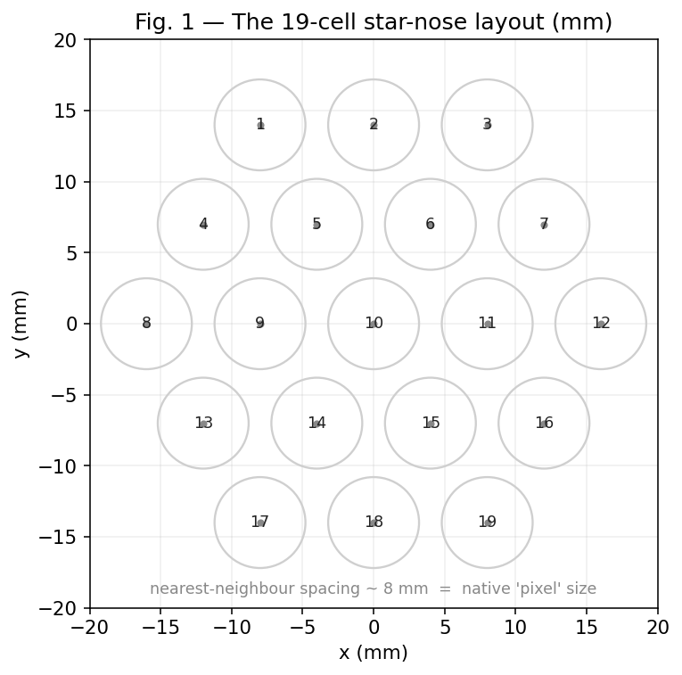

The whole project is about beating that 8 mm limit and extracting *more* than a
nearest-cell guess: continuous position, contact size, motion, and shape.

### 0.2 The forward model — from contact to activations

To reason about the problem it helps to picture the **forward direction**: a
physical contact at some point produces a smooth bump of activation that spreads
over neighbouring cells (Fig. 2a). The sensor then samples that bump at the 19
cell locations (Fig. 2b). The firmware also applies a square-root compression
(`activation = response**0.5`), which lifts weak, far-away responses.

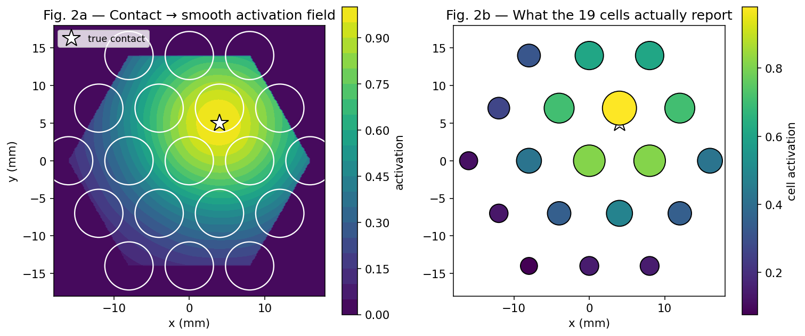

### 0.3 Why this is machine learning

ML solves the **inverse problem**: given the 19 sampled values, recover the thing
that caused them (position, size, motion). Two facts make this learnable:

1. The map from contact to activations is smooth and repeatable, so its inverse
   exists and can be approximated.
2. We get **labels for free**: the UR5 drives the pointer to a *known* position
   and depth, logged next to each frame. So every dataset row is a worked
   example of "these 19 values ⟶ this true answer." That is supervised learning.

> **Key mental model.** Static task = invert one frame. Dynamic task = invert a
> *sequence* of frames and then connect the dots over time.

---

# PART A — STATIC: where is the press, and how big?

## Lecture 1 — The physics baseline: weighted centroid

Before any ML, there is one estimator you must always compute, because it is
free and surprisingly strong: the **activation-weighted centroid**, i.e. the
centre of pressure.

$$ \hat{c} = \frac{\sum_i w_i\, p_i}{\sum_i w_i} $$

where $w_i$ is the activation of cell $i$ and $p_i=(x_i,y_i)$ its position. Cells
that light up more pull the estimate toward themselves (Fig. 3). Because
activation spreads across several cells, the centroid lands *between* cells —
that is how we already get sub-8 mm resolution from a coarse grid.

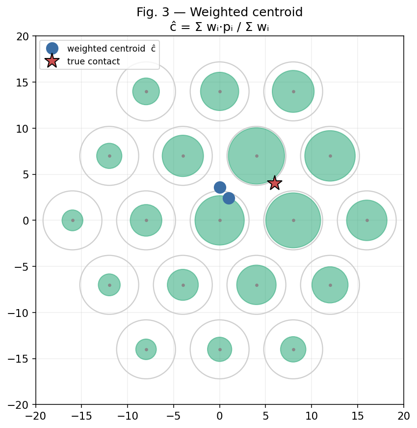

**Where it breaks.** The centroid is biased: near the rim, missing cells on the
outside pull it inward; unequal cell gains and the gamma warp distort it; and a
single centroid cannot describe two simultaneous touches. These systematic
errors are exactly what a learned model can *correct*, because they are
repeatable and the UR5 gives us the truth to learn from.

## Lecture 2 — Turning it into a supervised model

### 2.1 The pipeline

Every static method follows the same four blocks (Fig. 4): take a frame, build
features, run a model, read out the answer. Training labels come from the UR5.

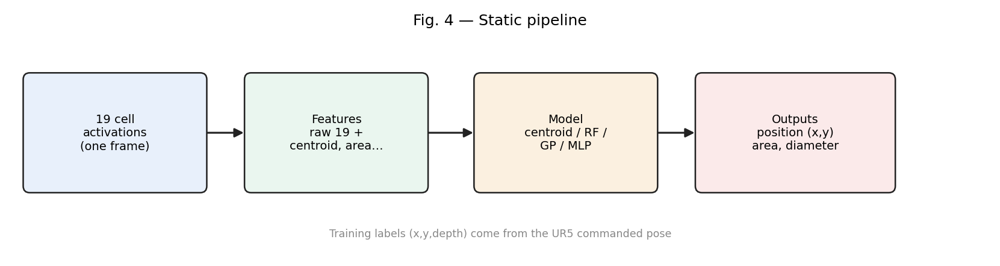

### 2.2 Features

We do not feed the raw 19 cells alone. We append the physically meaningful
summaries — centroid, spread, active-cell count, area, diameter — so the model
starts from good "hints" rather than rediscovering geometry. This is
`snm_common.design_matrix()`.

### 2.3 Choosing a model

| Model | Use it when | Strength | Weakness |
|---|---|---|---|
| Weighted centroid | always (baseline) | instant, interpretable | edge bias, single touch |
| k-NN | small, smooth data | trivial, interpolates | stores all data |
| **Random Forest** | tabular, moderate data | robust, non-linear | not smooth |
| Gaussian Process | need uncertainty | gives ± confidence | slow on big data |
| MLP / CNN | lots of data | best accuracy | data-hungry |

For 19 inputs and a few thousand presses, **Random Forest** is the right default
(your existing models use it). Reach for a **Gaussian Process** when you want a
confidence value per estimate.

### 2.4 Evaluating honestly

The single most important rule: **split by session, not by row.** Frames from one
press are nearly identical, so a random split lets the model "memorise" and
report fantasy accuracy. We use leave-one-session-out (group) cross-validation.

Fig. 5 shows the real result on your `events.csv`: the learned models cut the
held-out position error well below the centroid baseline.

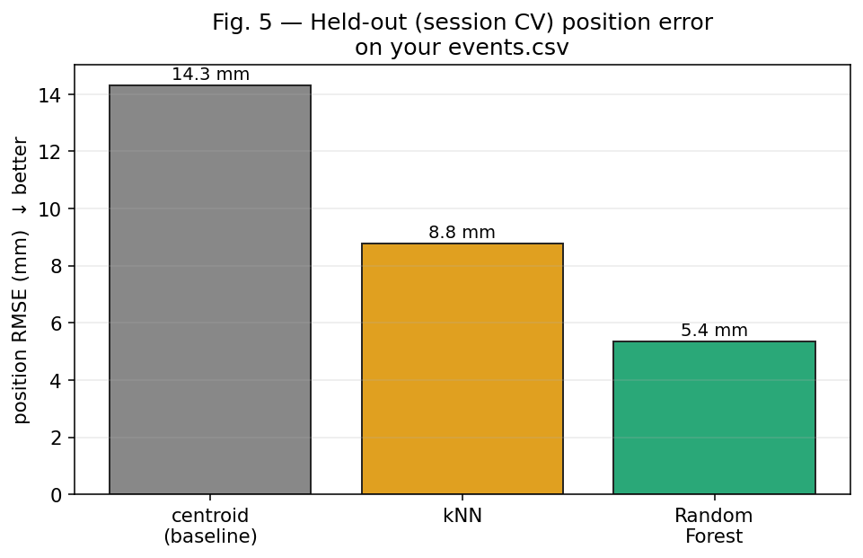

> Always report the baseline *and* the model. The gap is the value the ML adds —
> and it is largest near the edges, where the centroid is most biased.

## Lecture 3 — The "covering area" of a press

You also want the area a static push covers. We estimate it two ways (Fig. 6):
**soft hex-coverage** (sum each active cell's ~55 mm² hex footprint, scaled by
activation), then convert to an intuitive **equivalent-disc diameter**
$d = 2\sqrt{A/\pi}$. A bigger or harder contact lights more cells ⟶ larger
area ⟶ larger diameter.

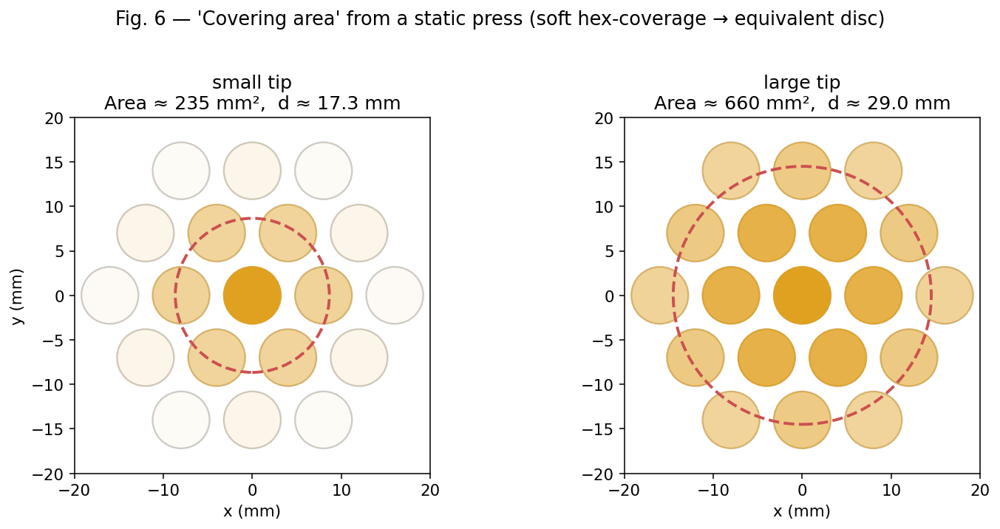

If you want a *learned* area/diameter model, train exactly as for position but
swap the target column to `diameter_est_mm` or `depth_mm` (you have these labels
in `events.csv`). That is what your existing `diameter_estimator_rf.pkl` does.

---

# PART B — DYNAMIC: motion, direction, shape, drawing

Now the pointer **moves**, and we work with a *time series* of frames. The plan:
localise each frame (Part A), then connect and smooth over time.

## Lecture 4 — Tracking with a Kalman filter

Per-frame centroids are jittery and snap between cells. A **constant-velocity
Kalman filter** fixes this by combining a motion model with each new
measurement. It keeps a state $[x, y, v_x, v_y]$ and repeats two steps every
frame (Fig. 7): **predict** where the pointer should be from its velocity, then
**update** that prediction with the freshly measured centroid.

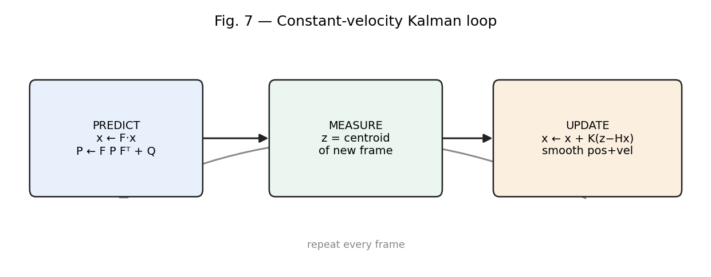

The payoff: a smooth position track *and* a velocity, from which **speed**
$=\lVert v\rVert$ and **direction/heading** $=\operatorname{atan2}(v_y,v_x)$ fall
out for free. Fig. 8 runs this on a simulated known circle — the noisy raw
centroids (orange) become a clean trajectory (green).

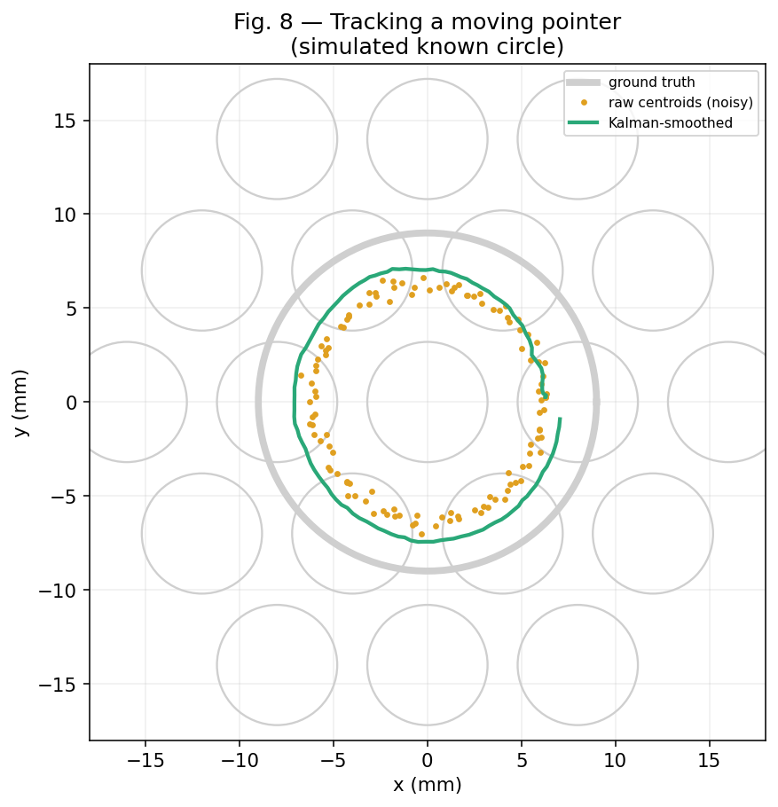

> Notice the green track sits slightly *inside* the true circle. That is the real
> centroid-contraction bias from Lecture 1 showing up in motion. A model trained
> on UR5 labels (Part A) removes it; this is why Parts A and B share the same
> localisation step.

## Lecture 5 — Reconstructing the drawing

Reconstruction chains everything together (Fig. 9): a stream of frames →
localise each → **gate** out the pen-up frames (low total activation) → Kalman
**smooth** → **spline** fit → read off the drawing plus its direction and shape.

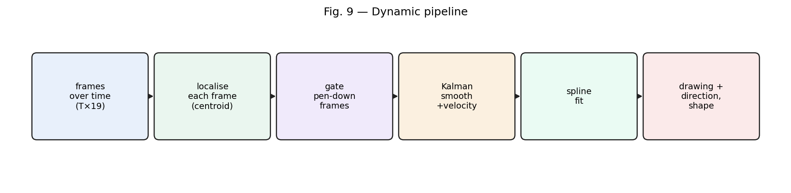

Fig. 10 shows the result on a simulated "S": the reconstructed stroke (green)
recovers the traced shape from the ground truth (grey), start (green dot) to end
(red square).

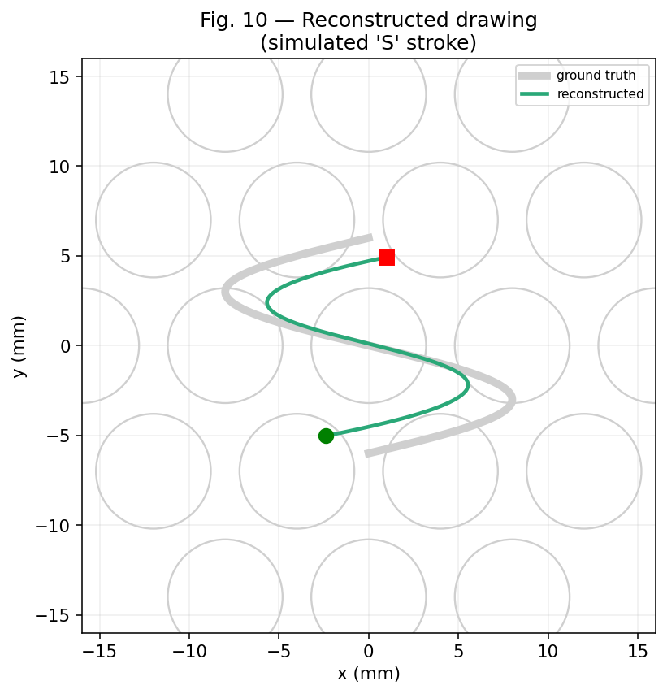

> **Important caveat for your data.** Your current logs are *discrete presses*,
> not continuous swipes, so Figs. 8 and 10 use a simulated moving contact to
> teach the method. To reconstruct real drawings you must first record
> continuous-contact sessions (Lecture 7).

## Lecture 6 — Describing motion: direction and shape

Beyond redrawing the path, three scalars summarise *what kind* of motion it was
(Fig. 11): **straightness** (net displacement ÷ path length: 1 = straight line,
→0 = loops/scribble), **total turning** (how curvy), and the **principal
direction** from PCA of the points (the dominant axis of travel — your
"directionality of the displacement").

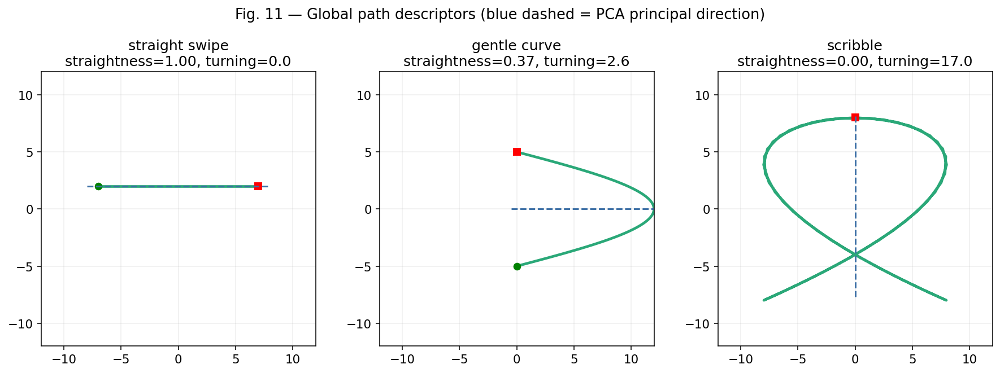

These already separate a straight swipe from a curve from a scribble *without
any deep learning*. Only if you need to **recognise** specific shapes (circle vs
square vs a letter) do you climb the next rung:

- **DTW + nearest template** — compare a new path against a few labelled examples;
  no training, great first step for recognition.
- **1-D CNN / TCN** — feed the (T×19) movie or (T×2) path; needs hundreds of labels.
- **LSTM seq2seq** — map frames directly to a trajectory (the "handwriting"
  formulation); most powerful, most data-hungry.

Rule of thumb: **Kalman + spline to reconstruct, DTW to recognise, deep nets
only when the data justifies them.**

## Lecture 7 — How to get the dynamic dataset (the experiment)

To make Part B real and measurable, record ground-truth motion:

1. Program the UR5 to trace **known paths** at the dome surface — lines at
   several angles, circles of known radius, polygons — staying in contact and
   logging frames at a fixed rate (the `dt` the Kalman filter uses).
2. The logged TCP $(x,y)$ per frame **is** the ground-truth trajectory, so you can
   measure reconstruction error (path RMSE, or DTW/Fréchet distance for shape).
3. Vary **speed**, and repeat each path across several sessions for honest
   held-out evaluation.

This converts "reconstruct a drawing" into a paper-ready result: trace known
shapes, reconstruct, report error vs the UR5 truth.

---

## Summary — the one-slide version

| | Static (Part A) | Dynamic (Part B) |
|---|---|---|
| Input | one 19-cell frame | sequence of frames |
| Core step | invert frame → (x, y), area | invert each frame, then track over time |
| Baseline | weighted centroid | per-frame centroid |
| Workhorse | Random Forest (+ GP for uncertainty) | Kalman filter + spline |
| Extras | learned area/diameter | PCA direction, descriptors; DTW/TCN/LSTM for recognition |
| Ground truth | UR5 commanded pose | UR5 traced path |
| Validate by | session-held-out RMSE | path RMSE / DTW vs traced shape |

## Run the code behind every figure

```bash
pip install -r "ML methods/requirements.txt"
python "ML methods/make_lecture_figures.py"   # regenerates figures/fig01..11
python "ML methods/train_static.py"           # Part A numbers (Fig. 5)
python "ML methods/dynamic_tracking.py"       # Part B tracking
python "ML methods/reconstruct_drawing.py"    # Part B reconstruction
```

See `GUIDE_ML_101.md` for the detailed, runnable manual and `references` therein.
```
